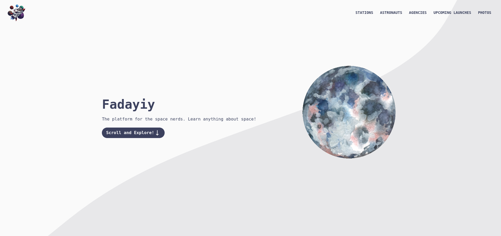

<h1 align="center">
  <br>
  Fadayiy App
  <br>
</h1>

<h4 align="center">A space platform for launches, photos, space agencies, astronauts and space stations, check out the <a href="https://github.com/AmineAML/fadayiy-api" target="_blank">API</a></h4>

<p align="center">
  <a href="#ethymology">Ethymology</a> •
  <a href="#how-to-use">How to use</a> •
  <a href="#built-with">Built with</a> •
  <a href="#repository-structure">Repository structure</a>
  <a href="#license">License</a> •
</p>



## Ethymology
Fadayiy meaning 'a space thing' in arabic, comes originally from my willingness to build this application with content in that language but wasn't satisfied with the translation options or they didn't offer a translation that was enough without having to proof read it for mistakes, which means going through hundreds of pages, a more than a one man's job.

## How to use
### Installation
This app is built with [Node.js](https://nodejs.org/en/) v14+ and [NPM](https://docs.npmjs.com/downloading-and-installing-node-js-and-npm) v8+, you can use Yarn or any other package manager after doing the required changes.
```bash
# Clone the repository
git clone git@github.com:AmineAML/fadayiy-app.git
cd fadayiy-app
npm install
```
### Developing
Before running the app, rename `.env.example` to `.env` and add your environment variables.
```bash
npm run dev
```

### Building
```bash
npm run build
```

> You can preview the built app with `npm run preview`, or using other options like [http-server](https://github.com/http-party/http-server) `npx http-server dist`. This should _not_ be used to serve your app in production.

### Deploying
We're using [Vercel](https://vercel.com/) or you can use [Docker](https://www.docker.com/).

## Built with
- [Astro](https://astro.build/)
- [Svelte](https://svelte.dev/)
- [Tailwind CSS](https://tailwindcss.com)
- [daisyUI](https://daisyui.com)
- [graphql-request](https://github.com/prisma-labs/graphql-request)
- [Vercel](https://vercel.com/)

## Repository structure
```
/
├─ src/
│  ├─ lib/           # Variables
│  │
│  ├─ pages/         # Pages
│  │
│  ├─ components/    # Components
│  │
│  ├─ styles/        # Pages
│
├─ public/           # Assets
└─ ..                
```

## License
This project is license under [MIT](https://github.com/AmineAML/fadayiy-app/blob/main/LICENSE).